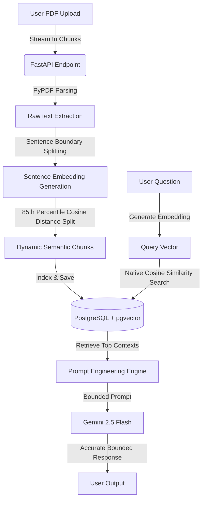

# 🚀 PDF Q&A Bot: Enterprise-Grade Semantic RAG System

A high-performance, containerized Retrieval-Augmented Generation (RAG) backend built with **FastAPI**, **PostgreSQL (pgvector)**, and **Google Gemini 2.5**. This system allows users to upload PDF documents, automatically performs dynamic semantic chunking, indexes text passages in a vector database, and generates highly accurate, hallucination-free answers anchored in the uploaded context.

---

## 📌 Problem Statement

Traditional document search and basic RAG pipelines face three core challenges:
1. **Loss of Context (Dumb Chunking)**: Slicing text into static token windows (e.g., every 500 characters) splits sentences and ideas in half, destroying the semantic integrity of the document.
2. **In-Memory Bottlenecks**: Performing vector calculations (like Cosine Similarity) inside the application memory (using NumPy loops) does not scale when dealing with thousands of documents.
3. **Hallucinations**: Generative AI models often construct plausible-sounding but completely incorrect answers when not provided with highly relevant, bounded context.

### The Solution:
This project implements **Dynamic Semantic Chunking** and **Database-Native Vector Search**:
* Text is split dynamically at sentence boundaries when the cosine distance between consecutive sentences exceeds the 85th percentile of the document's overall similarity distribution.
* Bounded search queries are executed natively inside **PostgreSQL** using the `pgvector` extension.
* Bypasses hallucinations by anchoring the prompt to retrieved contexts, returning a fallback message when answers are not found in the documents.

---

## 🛠️ Tech Stack

| Technology | Category | Purpose |
| :--- | :--- | :--- |
| **FastAPI** | Web Framework | High-performance, asynchronous REST API endpoints. |
| **PostgreSQL + pgvector** | Vector Database | Native storage and mathematical similarity search of 384-dimension vector embeddings. |
| **SentenceTransformers** | ML Embedding Model | Local execution of the `all-MiniLM-L6-v2` model for sentence-level embeddings. |
| **Google Gemini API** | Large Language Model | Generates context-aware, structured answers using `gemini-2.5-flash`. |
| **Langfuse (v4)** | Observability / Telemetry | OpenTelemetry-native RAG pipeline monitoring (latency, prompts, and token costs). |
| **Sentry** | Exception Tracking | Automated real-time backend crash reporting and error alerting. |
| **Docker & Docker Compose** | DevOps / Orchestration | Isolates the PostgreSQL database container with pgvector extension enabled. |
| **SQLAlchemy** | ORM | Database-to-object mapping and SQL query abstraction. |
| **Pydantic V2** | Data Validation | Runtime type validation for API request and response models. |

---

## 📐 System Architecture



---

## 🚀 Key Features

* **Dynamic Semantic Splitter**: Tokenizes text into logical sentences, analyzes consecutive distance metrics, and splits documents dynamically where topics shift.
* **Database-Level Distance Math**: Replaces local Python similarity computations with SQL-native cosine distance lookups (`FileVector.embedding.cosine_distance`).
* **LLM Telemetry (Langfuse v4)**: OpenTelemetry-native tracing of prompt templates, vector similarity search latencies, and Gemini token counts/costs.
* **Real-time Exception Tracking (Sentry)**: Captures unhandled backend exceptions, tracebacks, and database drops instantly.
* **Asynchronous File Streaming**: Processes large files asynchronously with `aiofiles` and non-blocking I/O.
* **Robust Scaffolding**: Defensive programming with wrapped database sessions, schema validation, and HTTP-compliant error payloads (e.g. 400, 422, 500 status codes).
* **Automatic Schema Initialization**: Auto-activates `CREATE EXTENSION IF NOT EXISTS vector` on database startup.

---

## ⚙️ Quick Start & Installation

### Prerequisites
* Docker & Docker Desktop installed.
* Python 3.10+ installed locally.
* A Google Gemini API Key.

### 1. Configure the Environment
Create a `.env` file in the root directory:
```env
GEMINI_API_KEY="your-gemini-api-key-here"

# Langfuse Observability
LANGFUSE_PUBLIC_KEY="pk-lf-..."
LANGFUSE_SECRET_KEY="sk-lf-..."
LANGFUSE_HOST="https://cloud.langfuse.com"

# Sentry Monitoring (Optional)
SENTRY_DSN="your-sentry-dsn-here"
```

### 2. Start the Vector Database (Docker)
Run the following command to spin up the PostgreSQL container:
```bash
docker compose up -d db
```
*This starts a database running on port `5432` with automatic persistence volume mappings.*

### 3. Run the FastAPI App (Locally)
Install dependencies and start the hot-reloading development server:
```bash
pip install -r requirements.txt
uvicorn main:app --reload
```
The server will start on **`http://localhost:8000`**.

---

## 🔌 API Endpoints Documentation

Visit **`http://localhost:8000/docs`** to interact with the API via Swagger UI.

### 1. Upload & Index PDF
* **Endpoint**: `POST /uploads/`
* **Content-Type**: `multipart/form-data`
* **Request**: Upload a `.pdf` file.
* **Response**:
  ```json
  {
    "message": "File processed and vectors stored successfully.",
    "file_name": "civil_engineering_handbook.pdf",
    "total_chunks": 184
  }
  ```

### 2. Semantic Search
* **Endpoint**: `POST /find_similiar_chunks/`
* **Payload**:
  ```json
  {
    "question": "What is the partial safety factor for tension yielding?"
  }
  ```
* **Response**: Returns the top 5 most mathematically similar text passages stored in the database.

### 3. Retrieval-Augmented Generation (Q&A)
* **Endpoint**: `POST /ask_question/`
* **Payload**:
  ```json
  {
    "question": "What is the partial safety factor for tension yielding?"
  }
  ```
* **Response**:
  ```json
  {
    "answer": "The partial safety factor for failure in tension by yielding is γm0 = 1.10, as specified in Section 5.4."
  }
  ```

